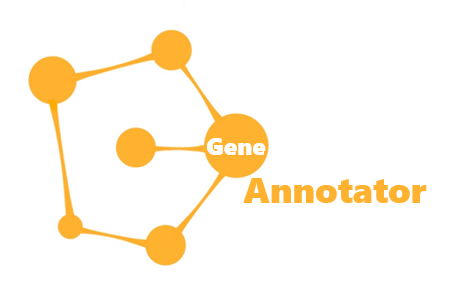

<p align="center">
    
</p>

# A-Semi-automatic-Annotation-Software-for-Scene-Graph

Zhixuan Zhang, Chi Zhang, Yuehu Liu


## Introduction

这个软件是一个xxxx, which is designed for researchers and engineers to annotate scene graph.


### Major Features

我们提出了标注软件，这是一个开源框架，它将基于python语言编写

- **用户交互性良好**: 用有可视化UI，能够在图像中显示用户标注的内容，用户交互性十分友好。同时可以实时显示场景图，场景图显示效果如图2所示。
- **标注内容丰富**: 除了传统的关系数据，我们还提供了region/cluster/属性等关系的标注
- **人工标注成本低**: 我们在系统中提出了半自动化标注生成，可以根据
- **可扩展性强**: 可以自由定义自己底层代码
- **数据集泛化性良好**: 数据集输出以vg的架构组织，可以直接用于现有学习框架

### 工作演示
视频


### 软件框架图

在标注软件中，有为三个关键模块：关系标注模块、半自动化标注模块和辅助功能模块，模块概览如图3所示。每个模块相互独立，可以去掉其中一部分不影响使用，便于维护和更新。下面，我们将详细介绍这些模块。

#### 关系标注模块
#### 辅助功能模块
#### 半自动化标注模块


## Updates【未修改】

 **06 May 2020:** Our paper is online, you are welcomed to download the paper at [here](https://128.84.21.199/abs/2005.02154).

 **29 April 2020:** Our PyRetri is launched!

## Installation

Please refer to [INSTALL.md](docs/INSTALL.md) for installation and dataset preparation.

## Get Started

Please see [GETTING_STARTED.md](docs/GETTING_STARTED.md) for the basic usage of PyRetri.

## 构建的数据集
我们从cityscapes中构建了1000张的数据集，数据集下载和说明链接请参考：
数据集可以直接用做现有vg框架。

## License

This project is released under the [Apache 2.0 license](LICENSE).

## Citation【未修改】

If you use this toolbox in your research, please cite this paper.

```
@inproceedings{Hu2020PyRetri,
  author    = {Benyi Hu and Ren{-}Jie Song and
               Xiu{-}Shen Wei and Yazhou Yao and
               Xian{-}Sheng Hua and Yuehu Liu},
  title     = {PyRetri: {A} PyTorch-based Library for Unsupervised Image Retrieval
               by Deep Convolutional Neural Networks},
  booktitle = {{ACM} International Conference on Multimedia ({ACM MM})},
  pages     = {4461--4464},
  year      = {2020},
}
```


## Contacts

If you have any questions about our work, please do not hesitate to contact us by emails.

Zhixuan Zhang: [zxzhang970320@stu.xjtu.edu.cn](mailto:zxzhang970320@stu.xjtu.edu.cn)

## Acknowledgements

This project is supported by the Fundamental Research Funds for 【待填写】, No. 【待填写】.


