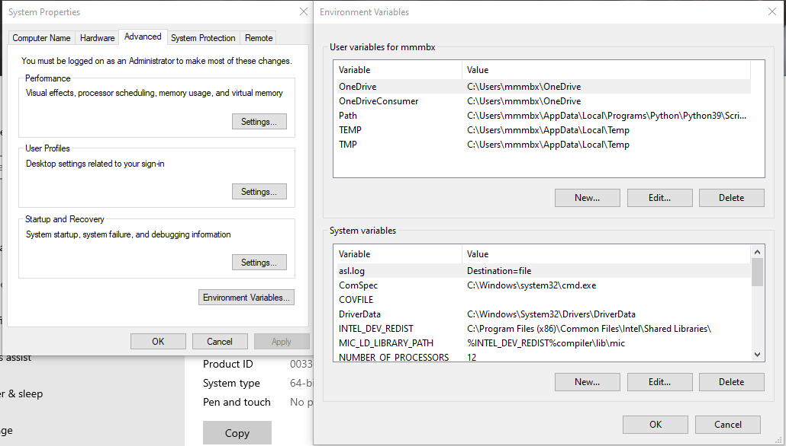
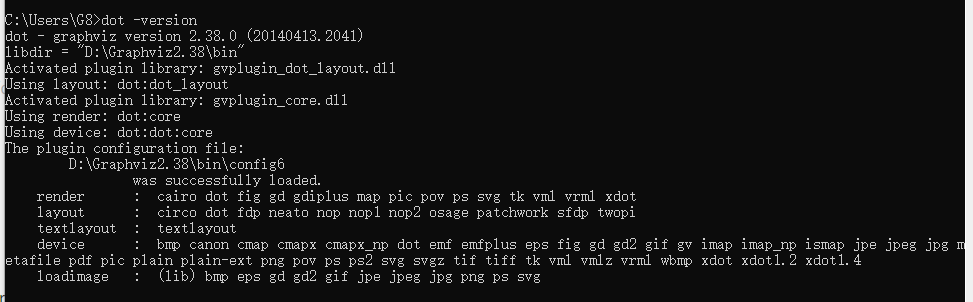
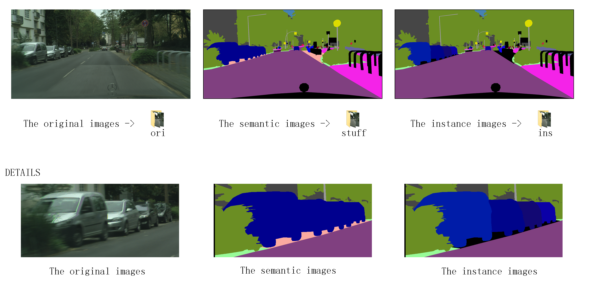
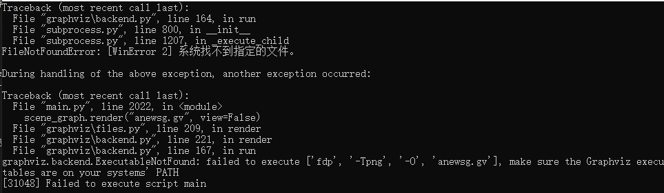

Installation

## Requirements

- Windows (Not tested in Linux)
- Python 3
- numpy
- collections
- tkinter
- PIL
- graphviz
- json
- h5py
- opencv-python

### Step-by-step installation

 #### install graphviz (very important)
1. Download and install graphviz from [here](https://graphviz.org/download/).
2. Setting environment variables: Add "graphviz/bin" to the path.
    windows: Computer - System Properties - Advanced - Environment Variables
    
3. Test:

       dot -version

4. Load:

       pip install graphviz

 #### install other requirements
    # first, make sure that your Python3 is setup properly with the right environment
  
    pip install numpy
    pip install collections
    pip install tkinter
    pip install PIL
    pip install json
    pip install h5py
    pip install opencv-python
    
    

## Use GeneAnnotation
1. Install Python3 following the official instructions.
2. Clone the GeneAnnotator repository.
3. Run "main.py"

## Customize Your Own Scene Graph Datasets
We have prepare the sample input images (from Cityscapes) in the repository. If you want to change the scene graph structure or annotate the new images, please refer to this section.

### Scene Graph Structure
In "Init.py", you can define object lists, object categories, object hierarchies, relationship lists, relationship categories,and relationship hierarchies.

For example, in Traffic Genome, we use the object lists and object categories from [Cityscapes](https://www.cityscapes-dataset.com/dataset-overview/), and object hierarchies, relationship lists, relationship categories,and relationship hierarchies from [paradigm for traffic scene graph](https://dl.acm.org/doi/10.1145/3436369.3437437).

### Input image
You should put images in the corresponding folders:
- The original images -> "ori" 
- The semantic images -> "stuff"  
- The instance images -> "ins" 

Note: Three images for a scene should be in the same file name and the same scale.

## Frequently Asked Questions
1. Q: What's wrong?

A: Please install **graphviz**.
